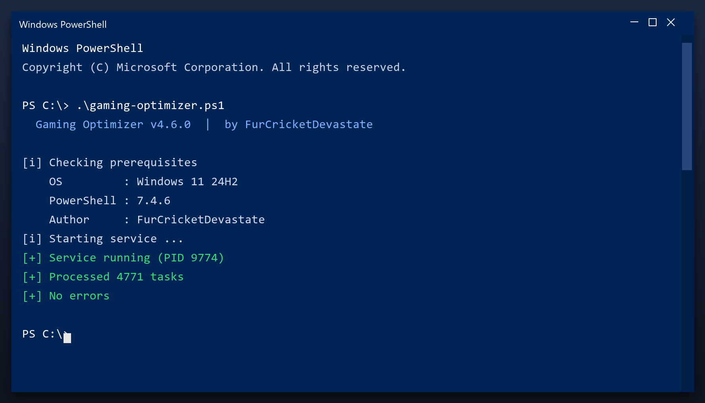

# Gaming Optimizer — Free Download [2026]

 

Gaming optimizer is a lightweight Windows program for maintaining your system. It runs offline, uses very little memory and does not slow your computer down. **Completely free.**

  

  

## Specification

| | |
| --- | --- |
| **Program** | Gaming Optimizer |
| **Version** | Latest 2026 build |
| **Price** | Free |
| **Systems** | see requirements below |
| **Download** | Quick Start section below |

| **Feature** | **Details** |
| --- | --- |
| **Size** | Small download, quick install |
| **Scan speed** | Typically under 3 minutes |
| **Background use** | None when closed |
| **Ads** | None |
| **Bundled extras** | None |
| **Offline** | Works without internet |

## Requirements

| **Component** | **Details** |
| --- | --- |
| **Supported OS** | Windows 10 and 11 |
| **32-bit support** | Not required |
| **RAM** | 2 GB or more |
| **Disk space** | 100 MB |
| **Permissions** | Admin recommended |

## Installation

1. **Download** and unzip the package
2. **Right-click** the program and choose Run as administrator
3. **Choose a scan type** (quick or deep)
4. **Wait** for the report
5. **Select** the items to remove and confirm

> **Note:** this tool changes system settings, so antivirus software may be cautious. Add an exclusion if needed - the build on this page is tested.

## Comparison

| **Feature** | **Other free tools** | **gaming optimizer** |
| --- | --- | --- |
| **Bundled adware** | Often | Never |
| **Accounts** | Sometimes | Not needed |
| **Telemetry** | Often on | Off |
| **Cost** | Free with upsells | Free |

## Package Contents

| **Component** | **Details** |
| --- | --- |
| **Executable** | The tool itself |
| **Config** | Defaults already set |
| **Guide** | Plain-language walkthrough |
| **Support** | Issues section in this repo |

## Description

Gaming optimizer is what is often called a PC cleaner. It looks through the places Windows and your programs leave data behind - temp folders, logs, caches - and lets you remove it safely. A backup is made first, so nothing is lost by accident.

| **Term** | **Meaning** |
| --- | --- |
| **Temp folder** | Where programs dump scratch files |
| **Log** | A record file programs write |
| **Backup** | A copy you can restore |
| **Safe to delete** | Not needed by any program |

## Troubleshooting

| **Issue** | **Fix** |
| --- | --- |
| **Windows warns about the file** | Click More info, then Run anyway |
| **Slow first launch** | Normal - it indexes on first run |
| **Scan finds nothing** | Good - your PC is already clean |
| **Settings do not save** | Run as admin once so it can write config |

## FAQ

**Is admin access required?**

For a full cleanup, yes. Without it the tool only cleans your user folders.

**Will it fix my registry?**

It can scan and repair broken entries, and it backs up before changing anything.

**Does it work offline?**

Yes - once downloaded it needs no internet connection.

**How much space will I save?**

It varies, but most PCs recover several gigabytes on the first run.

---

*solar-cloud-511 · Updated 2026-10-10 · Shared under the MIT License*
